[](https://forthebadge.com)
[](https://www.python.org/)
[](https://github.com/huyhoang17/DB_text_minimal)
[](https://forthebadge.com)

# A Pytorch implementation of [DB-Text paper](https://arxiv.org/abs/1911.08947)

*Make awesome things that matter.*

<p align="center">
  
</p>

### Command

#### Train model

- Modify some configuration in config.yaml

```bash
make train
```

#### Test model

```bash
make test-all
```

#### Evaluate model

- For evaluation metric, please refer to [MegReader](https://github.com/Megvii-CSG/MegReader/blob/master/concern/icdar2015_eval) repository

```bash
# iou-based Pascal
make ioueval

# overlap-based DetEval
make deteval
```

### History (on TotalText dataset)

#### Train data

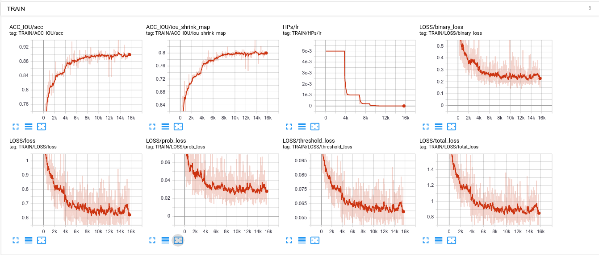

#### Test data

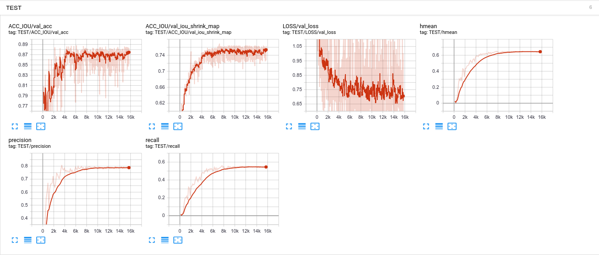

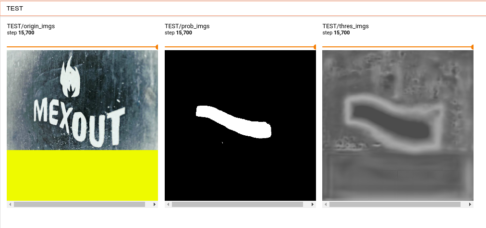

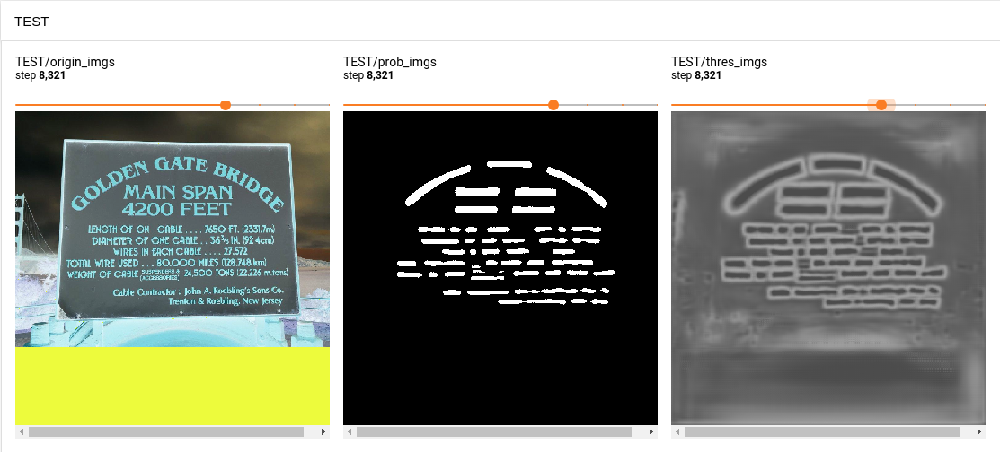

### Test dataset (TotalText)

| Heatmap | Polygon | Rotated rectangle |
|:-----:|:-----:|:-----:|
|  | 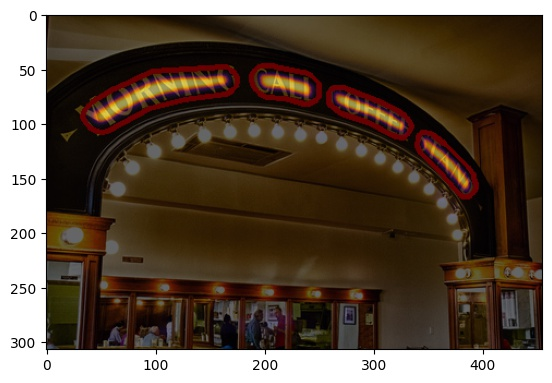 |   |
| 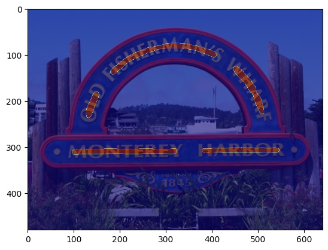 | 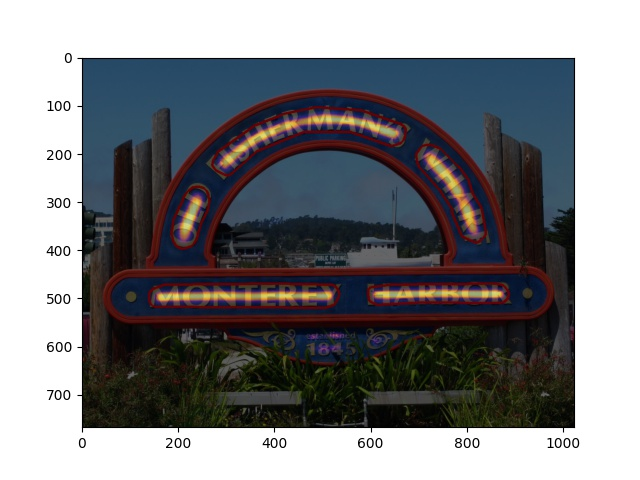 |  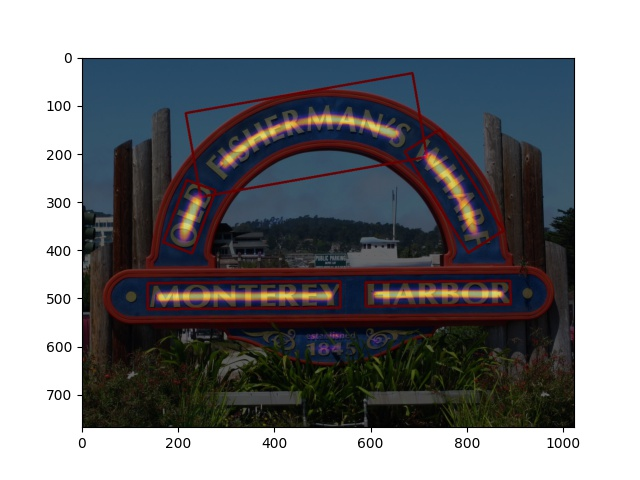 |
| 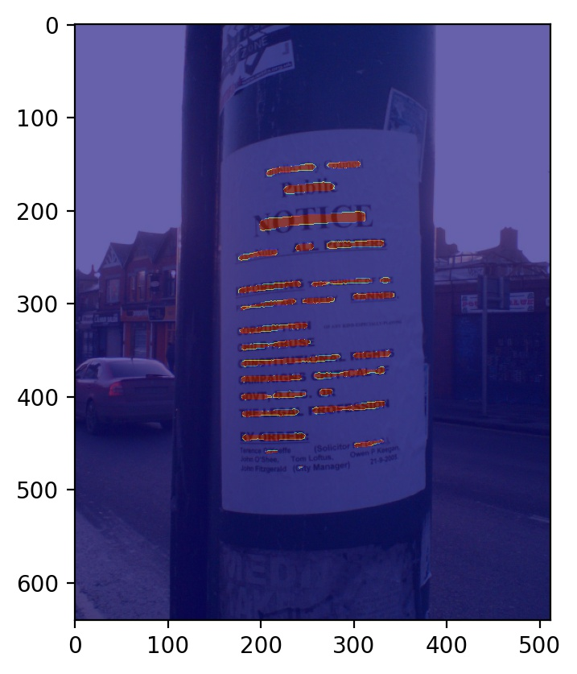 |  |  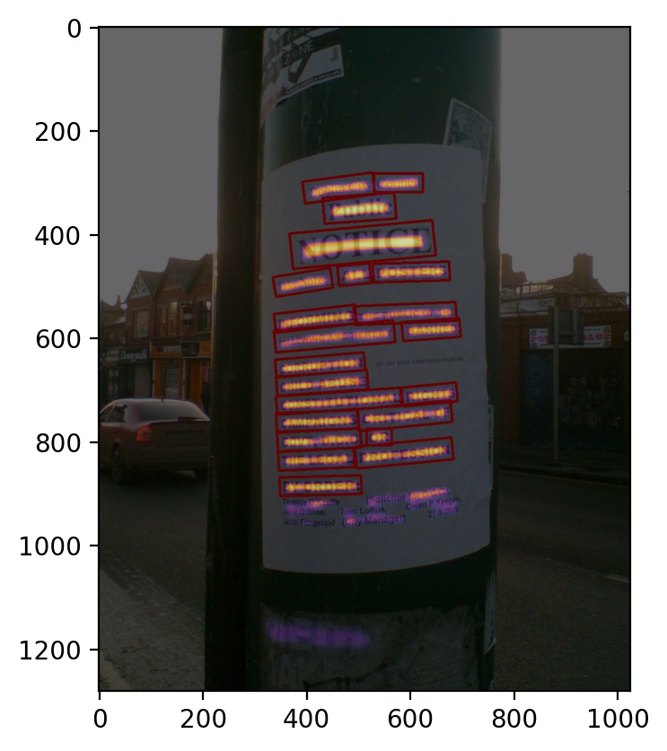 |

### Text-line detection (the model trained on CTW1500 dataset)

| Image origin | Text-line detected |
|:-----:|:-----:|
|  | 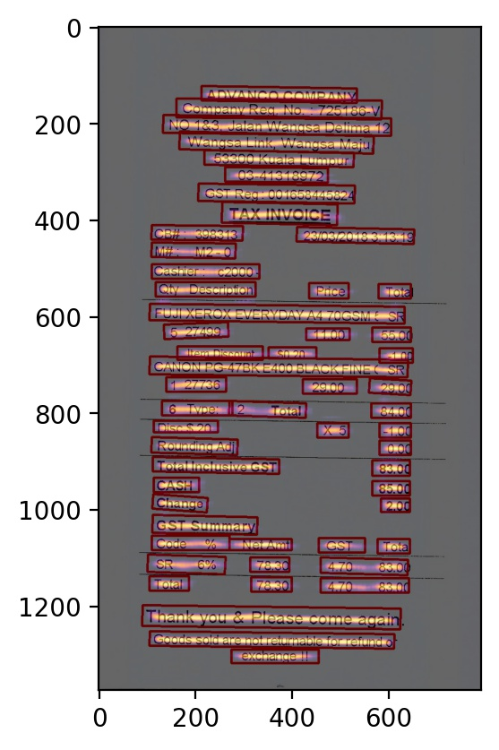 |
| 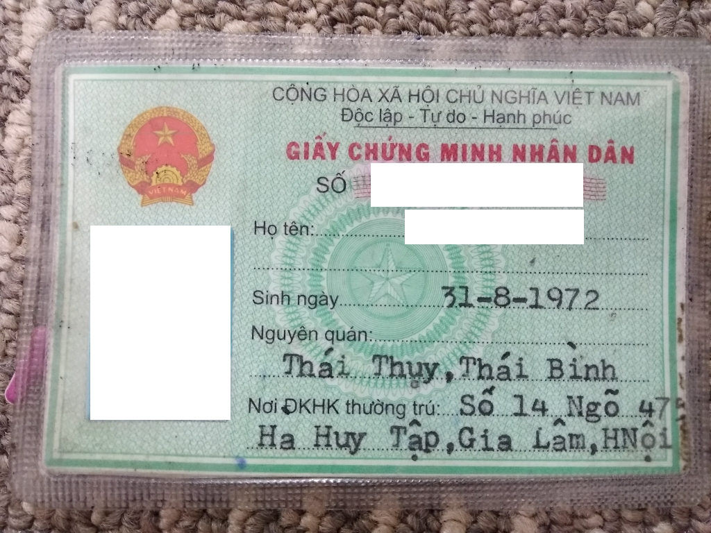 | 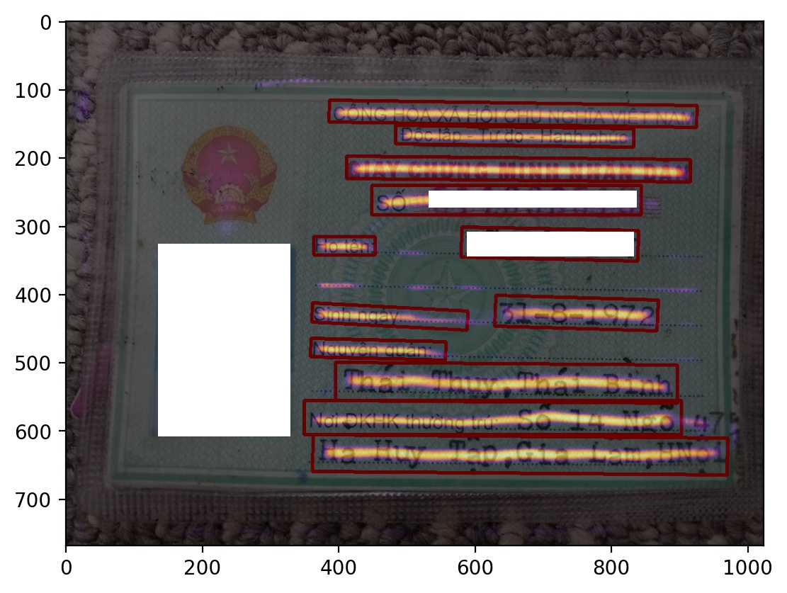 |

### Full pipeline

- Recognition model was trained on [MJSynth](http://www.robots.ox.ac.uk/~vgg/data/text/) and [SynthText](http://www.robots.ox.ac.uk/~vgg/data/scenetext/) dataset


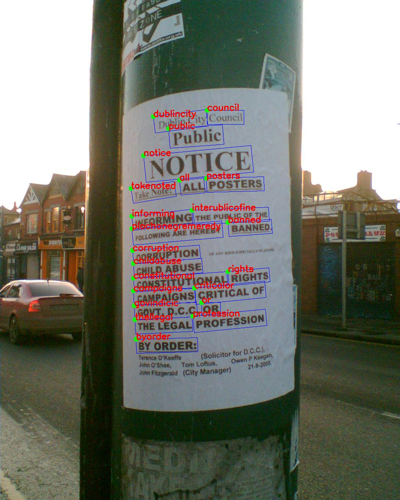

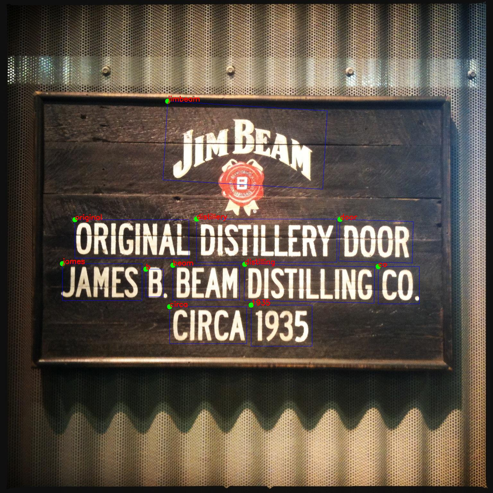

### Metric evaluation (DetEval - P/R/HMean)

```bash
# for TotalText dataset
make deteval
```

| Method                   | image size | init lr | b-thresh | p-thresh | unclip ratio | Precision | Recall | F-measure |
|:--------------------------:|:-------:|:--------:|:--------:|:--------:|:--------:|:--------:|:------------:|:---------------:|
| TotalText-resnet18-fcn (word-level) | 640 | 0.005 | 0.25 | 0.50 | 1.50 | 0.70 | 0.64 | 0.67 |
| CTW1500-resnet18-fcn (line-level) | 640 | 0.005 | 0.25 | 0.50 | 1.50 | 0.83 | 0.66 | 0.74 |

### ToDo

- [ ] Support datasets
	- [x] [TotalText](https://github.com/cs-chan/Total-Text-Dataset)
	- [x] [ICDAR2015](https://rrc.cvc.uab.es/?ch=4)
	- [x] [SCUT-CTW1500](https://github.com/Yuliang-Liu/Curve-Text-Detector)
	- [x] [MSRA-TD500](http://www.iapr-tc11.org/mediawiki/index.php/MSRA_Text_Detection_500_Database_(MSRA-TD500))
	- [ ] [COCO-Text](https://rrc.cvc.uab.es/?ch=5)
	- [ ] [Synthtext](https://www.robots.ox.ac.uk/~vgg/data/scenetext/)
	- [ ] [ArT2019](https://rrc.cvc.uab.es/?ch=14) (included Total-Text, SCUT-CTW1500 and Baidu Curved Scene Text dataset)
- [ ] Pytorch-lightning
- [x] Model serving with Torchserve
- [x] Metric callback (P/R/F1)
- [x] IoU-based metric (P/R/F1 - Pascal)
- [x] Overlap-based metric (P/R/F1 - DetEval)
- [ ] Model quantization
- [ ] Model pruning
- [ ] Docker / docker-compose
- [ ] ONNX, TensorRT
- [x] Text recognition model

### Reference

I got a lot of code from [DBNet.pytorch](https://github.com/WenmuZhou/DBNet.pytorch), thanks to [@WenmuZhou](https://github.com/WenmuZhou)

- [Real-time Scene Text Detection with Differentiable Binarization](https://arxiv.org/abs/1911.08947)
- [Evaluation metrics](https://github.com/Megvii-CSG/MegReader/blob/master/concern/icdar2015_eval)
- [DBNet.pytorch](https://github.com/WenmuZhou/DBNet.pytorch)
- [DBNet.keras](https://github.com/xuannianz/DifferentiableBinarization/)
- [Real-time-Text-Detection](https://github.com/SURFZJY/Real-time-Text-Detection)
- [PSENet.pytorch](https://github.com/whai362/PSENet)
- [deep-text-recognition-benchmark](https://github.com/clovaai/deep-text-recognition-benchmark)
- [volksdep](https://github.com/Media-Smart/volksdep)
- [TedEval](https://github.com/clovaai/TedEval)
- [torch2trt](https://github.com/NVIDIA-AI-IOT/torch2trt)