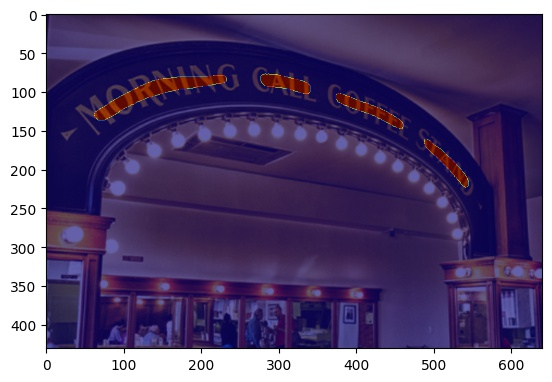
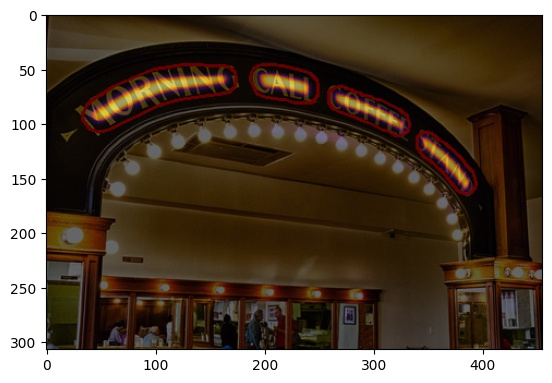

[](https://forthebadge.com)
[](https://www.python.org/)
[](https://github.com/huyhoang17/DB_text_minimal)
[](https://forthebadge.com)

# A Pytorch implementation of DB-Text paper

### Command

#### Train model

- Modify hyperparameters in config.yaml

```bash
make train
```

#### Test model

```bash
make test-all
```

#### Evaluate model

- For evaluation metric, please refer to [this](https://github.com/Megvii-CSG/MegReader/blob/master/concern/icdar2015_eval) repository

```bash
# for iou-based pascal-eval
make ioueval  # not recommend for polygon ground-truth

# for overlap-based det-eval
make deteval
```

### History

#### Train history


#### Test history


### Results

- Heatmap



- Polygon result



- Rotated rectangle result


### Metric evaluation (DetEval - P/R/HMean)

```bash
# for TotalText dataset
make deteval
```

| Method                   | image size | init lr | b-thresh | p-thresh | unclip ratio | Precision (%) | Recall (%) | F-measure (%) |
|:--------------------------:|:-------:|:--------:|:--------:|:--------:|:--------:|:--------:|:------------:|:---------------:|
| TotalText-resnet18-fcn | 640 | 0.005 | 0.25 | 0.50 | 1.50 | 0.70 | 0.64 | 0.67 |


### TODO

- [ ] Support other dataset
	- [x] [TotalText](https://github.com/cs-chan/Total-Text-Dataset)
	- [ ] [ICDAR2015](https://rrc.cvc.uab.es/?ch=4)
	- [ ] [COCO-Text](https://rrc.cvc.uab.es/?ch=5)
	- [ ] [Synthtext](https://www.robots.ox.ac.uk/~vgg/data/scenetext/)
	- [ ] [CTW1500](https://github.com/Yuliang-Liu/Curve-Text-Detector)
	- [ ] [ArT2019](https://rrc.cvc.uab.es/?ch=14)
- [ ] Convert code to pytorch-lightning
- [ ] Serve model with Torchserve
- [x] Add metric callbacks (P/R/F1)
- [x] Add metric & code evaluation (P/R/F1 - IoU-based Pascal eval)
- [x] Add metric & code evaluation (P/R/F1 - Overlap-based DetEval eval)
- [ ] Model quantization
- [ ] Model pruning
- [ ] Docker / docker-compose

### Reference

- [Real-time Scene Text Detection with Differentiable Binarization](https://arxiv.org/abs/1911.08947)
- [Evaluation metrics](https://github.com/Megvii-CSG/MegReader/blob/master/concern/icdar2015_eval)
- [DBNet.pytorch](https://github.com/WenmuZhou/DBNet.pytorch)
- [DBNet.keras](https://github.com/xuannianz/DifferentiableBinarization/)
- [Real-time-Text-Detection](https://github.com/SURFZJY/Real-time-Text-Detection)